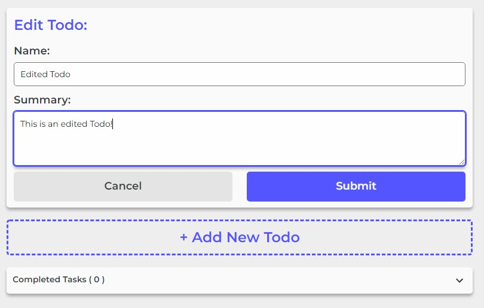

# Todo

Todo is a simple checklist of todo's that you can use to keep track of your progress for various tasks.

## Table of Contents

1. [Running the App](#running-the-app)
    * [Launching with Node](#launching-with-node)
    * [Launching with Docker](#launching-with-docker)
2. [Usage](#usage)
    * [Creating a New Todo](#creating-a-new-todo)
    * [Expanding a Todo](#expanding-a-todo)
    * [Focusing a Todo](#focusing-a-todo)
    * [Editing a Todo](#editing-a-todo)
    * [Completing a Todo](#completing-a-todo)
    * [Mobile](#mobile)
3. [Disclaimer](#disclaimer)

## Running The App

Currently, the site is not hosted anywhere that it can be publically accessed. However, you can easily run the site locally so long as you have `node` or Docker installed on your machine.

### Launching with Node

1. Open your terminal and navigate to the root directory of this repo
2. run `npm install` and wait for the require packages to be install
3. run `npm start`
4. Open your favourite browser and navigate to the URL that node provides once the developement server has started.

### Launching with Docker

There is a `Dockerfile` included at the root of this repo which can be used to launch this app using docker. It should included everything you need to get started.

## Usage

Once the app has been launched, using it is rather straight forward.

### Creating a New Todo

Clicking on the Add Todo button above the completed task accordion will open the New Todo form. Simply fill in the name of the todo, add an optional summary and then click submit to create a new Todo.

### Expanding a Todo

Click on any Todo to expand it to view the full summary and to see the various options for a Todo.

### Focusing a Todo

If you want to Focus a Todo inorder to track time on it. Simply expand the Todo and click the "Focus" button.

### Editing a Todo

To edit a todo, all you need to do is expand it and then click the "Edit" button. Once you are done editing the Todo, simply click the "Submit" button and you changes will be saved.

### Completing a Todo

To complete a Todo, simply click on the gray tick box on the left side of the Todo card. Once clicked, the Todo will be added to the Completed Tasks accordion.

### Mobile

The site is responsive and completely mobile friendly!

## Disclaimer

This repo was mainly made a was way for me to practice JS (Node and React), CSS and HTML. It is not intended for production use.